# 🤝 AffinityMind - Sistema de Recomendação com Embeddings e Similaridade Vetorial

<div align="center">
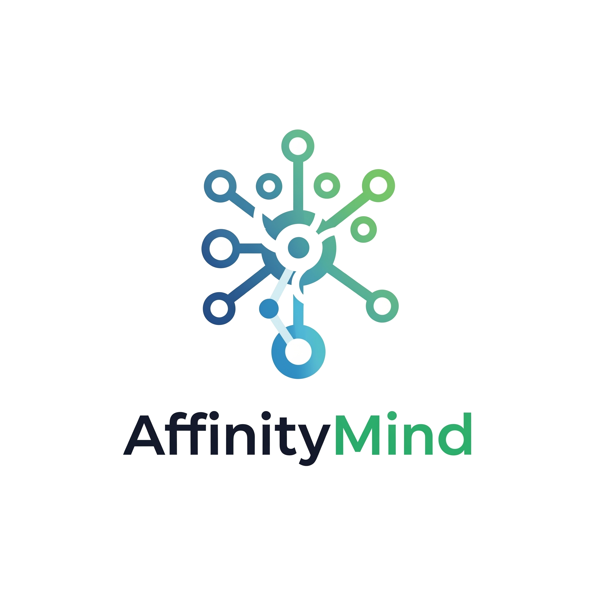

<div data-badges>
  
  
  
  
  
</div>
</div>

O **AffinityMind** é uma plataforma de recomendação baseada em embeddings, desenvolvida em Go e Python, que utiliza técnicas modernas de machine learning e busca vetorial para entregar recomendações personalizadas de forma eficiente e escalável.

✔️ **Backend em Go** para orquestração, API REST e lógica de recomendação

✔️ **Serviço de Embeddings em Python** (FastAPI + Sentence Transformers)

✔️ **Banco Vetorial em Python** (FastAPI + FAISS)

✔️ **Comunicação entre serviços via HTTP**

✔️ **Testes automatizados e ambiente Docker para fácil execução**

---

## 🖥️ Como rodar este projeto

### Requisitos:

- [Go 1.20+](https://golang.org/doc/install)
- [Python 3.10+](https://www.python.org/)
- [Docker & Docker Compose](https://docs.docker.com/get-docker/)

### Execução:

1. Clone este repositório:
   ```sh
   git clone https://github.com/lorenaziviani/affinity_mind.git
   cd affinity_mind
   ```
2. Configure vari√°veis de ambiente (opcional):
   ```sh
   cp .env.sample .env
   # Edite .env conforme necess√°rio
   ```
3. Suba todos os serviços com Docker Compose:
   ```sh
   docker-compose up --build
   ```
4. Execute os testes automatizados:
   ```sh
   make backend-test
   make embedding-test
   make vector-db-test
   ```

---

## üì∏ Prints do Projeto

### Subindo os serviços

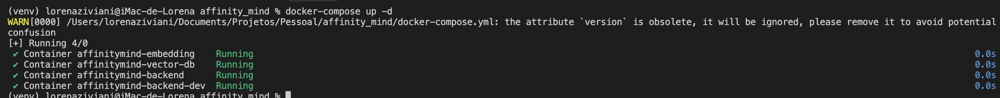

### Containers ativos

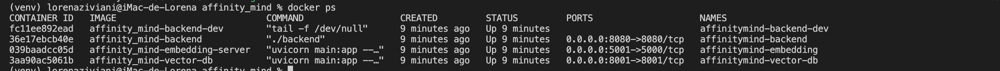

### Testes automatizados

#### Backend (Go)

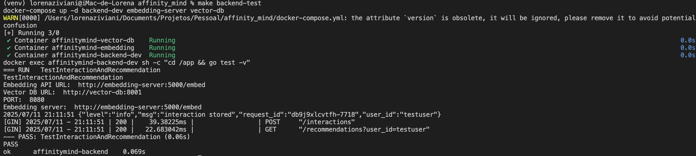

#### Embedding-server (Python)

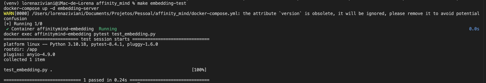

#### Vector-db (Python)

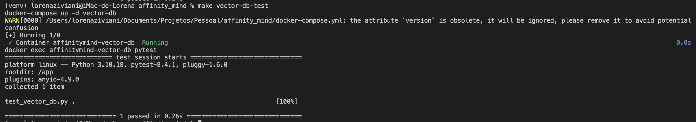

### Testando as APIs

#### Backend API

**Interações:**

```bash
curl -X POST http://localhost:8080/interactions \
  -H "Content-Type: application/json" \
  -d '{"user_id":"testuser","content":"itemA"}'
```

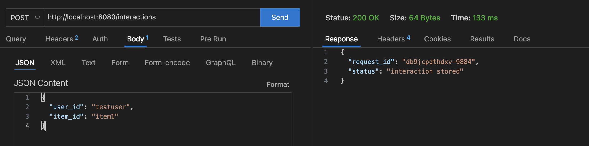

**Perfil demogr√°fico:**

```bash
curl -X POST http://localhost:8080/profile \
  -H "Content-Type: application/json" \
  -d '{"user_id":"testuser","age":30,"gender":"F","location":"SP"}'
```

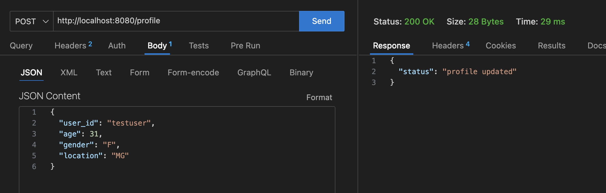

**Recomendações:**

```bash
curl -X GET "http://localhost:8080/recommendations?user_id=testuser"
```

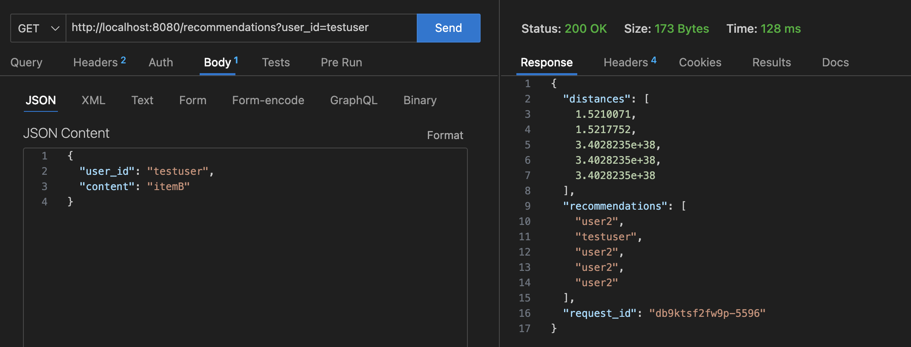

**Avaliação de precisão e recall:**

```bash
curl -X GET "http://localhost:8080/eval?user_id=testuser&k=5"
```

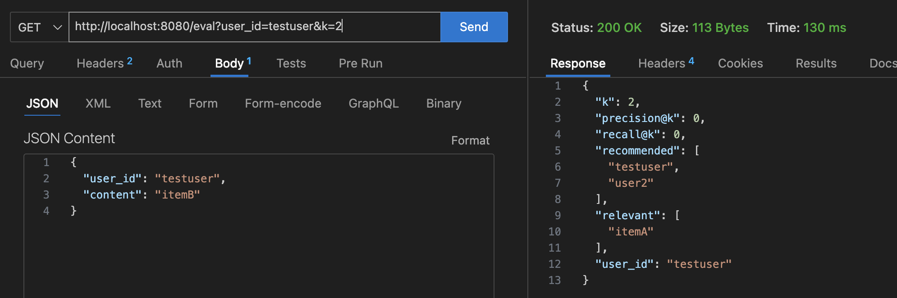

**Exemplo de resposta de avaliação:**

```json
{
  "user_id": "testuser",
  "k": 5,
  "precision@k": 0.5,
  "recall@k": 1.0,
  "recommended": ["user2", "testuser", "user2", "user2", "user2"],
  "relevant": ["itemA", "itemB"]
}
```

**Nota sobre dist√¢ncias grandes:**

- Quando o banco vetorial tem poucos vetores, o campo `distances` pode retornar valores como `3.4028235e+38` (maior float32 possível), indicando que não há vizinhos suficientes. Basta ignorar esses valores no frontend.

#### Embedding-server API

```bash
curl -X POST http://localhost:5000/embed \
  -H "Content-Type: application/json" \
  -d '{"text":"hello world"}'
```

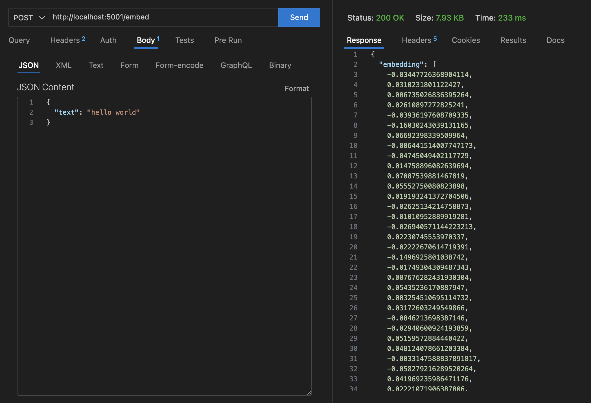

**Exemplo de resposta:**

```json
{
  "embedding": [0.12, 0.34, ...],
  "elapsed_ms": 12
}
```

#### Vector-db API

**Inserir vetor:**

```bash
curl -X POST http://localhost:8001/insert \
  -H "Content-Type: application/json" \
  -d '{
    "id": "testuser",
    "vector": [0.12, 0.34, ...]
  }'
```

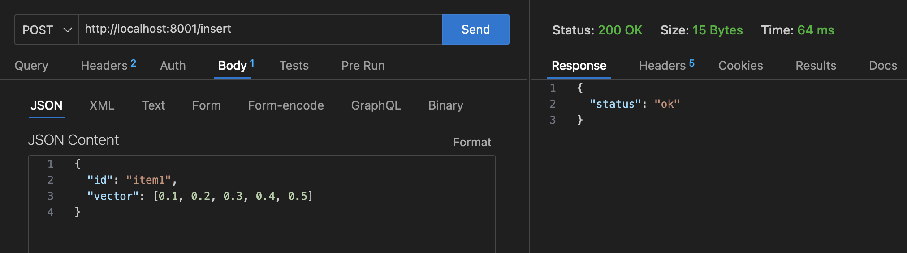

**Consultar similaridade:**

```bash
curl -X POST http://localhost:8001/query \
  -H "Content-Type: application/json" \
  -d '{
    "vector": [0.12, 0.34, ...],
    "k": 5
  }'
```

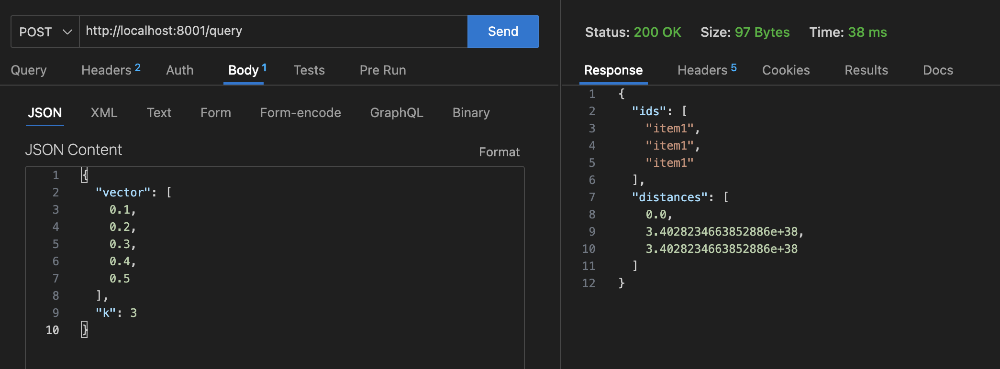

**Exemplo de resposta:**

```json
{
  "ids": ["user2", "testuser", "user2", "user2", "user2"],
  "distances": [1.52, 1.52, 3.4028235e38, 3.4028235e38, 3.4028235e38]
}
```

---

## üìù Principais Features

- **API RESTful para interações e recomendações**
- **Geração de embeddings de texto via modelo local (Sentence Transformers)**
- **Armazenamento e busca vetorial eficiente com FAISS**
- **Comunicação entre microserviços via HTTP**
- **Testes automatizados para todos os serviços**
- **Ambiente Docker para desenvolvimento e produção**

---

## 🛠️ Comandos de Teste

```bash
# Testes do backend Go
make backend-test

# Testes do embedding-server Python
make embedding-test

# Testes do vector-db Python
make vector-db-test
```

---

## 🏗️ Arquitetura do Sistema

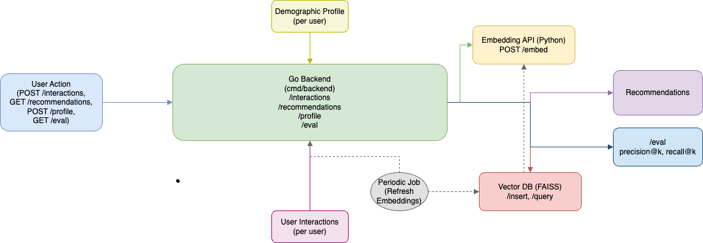

**Fluxo detalhado:**

1. O usuário faz uma interação via API do backend (Go)
2. O backend solicita o embedding do texto/item ao embedding-server (Python)
3. O embedding é armazenado e consultado no vector-db (Python/FAISS)
4. O backend retorna recomendações baseadas na similaridade vetorial

---

## üåê Vari√°veis de Ambiente (exemplo)

```env
# .env.example
EMBEDDING_API_URL=http://embedding-server:5000
VECTOR_DB_URL=http://vector-db:8001
PORT=8080
```

---

## 📁 Estrutura de Pastas

```
affinity_mind/
  docker-compose.yml
  Makefile
  .env.sample
  cmd/
    backend/           # Backend Go (main.go, Dockerfile, etc)
  infra/
    vector-db/         # Banco vetorial (main.py, requirements.txt, etc)
  ml/
    embedding-server/  # API Python de embeddings (main.py, requirements.txt, etc)
  docs/
    arquitetura.drawio # Diagrama de arquitetura
  .gitassets/          # Imagens para README
```

---

## üíé Links √∫teis

- [Go Documentation](https://golang.org/doc/)
- [FastAPI](https://fastapi.tiangolo.com/)
- [FAISS](https://github.com/facebookresearch/faiss)
- [Docker](https://www.docker.com/)
- [Sentence Transformers](https://www.sbert.net/)

---
